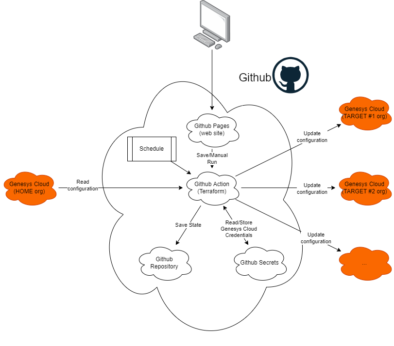

# Business Continuity for Genesys Cloud

> This code is provided as-is and should not be used in a production environment. For production-ready applications, please get in touch with the Genesys Professional Services department.

This repository contains a set of Github actions and a web frontend to democase Business Continuity (NOT Disaster Recovery) for Genesys Cloud.

In short, it uses Terraform to synchronize configuration objects between a `HOME` Genesys Cloud organization and a `TARGET` Genesys Cloud organization.

## Requirements

- Access to Github (you will need to fork this repo)
- Access to 2 Genesys Cloud organizations (1 home, 1 target) with admin access

## Limitations

- We currently support synchronizing the following configuration objects:

  - Users
  - Roles
  - Skills
  - Queues
  - Flows

- The `TARGET` org should be empty except for the administrator user which should not exist in the `SOURCE` org.
- If configuration objects on the `TARGET` org match with objects on the `SOURCE` when it is executed the first time, it will fail.

## How to use

- Clone this repository
- Genesys Cloud Credentials
  - Create a new OAuth Client id/secret pair in your `HOME` Genesys Cloud organization. Make sure it has sufficient permissions to read configuration objects listed in the [Limitations](#limitations) section.
  - Create a new OAuth Client id/secret pair in your `TARGET` Genesys Cloud organization. Make sure it has sufficient permissions to read **and write** configuration objects listed in the [Limitations](#limitations) section.
- Github Configuration
  - Create a new [Github personal access token](https://docs.github.com/en/authentication/keeping-your-account-and-data-secure/creating-a-personal-access-token) for your Github account
    - Required scopes
      - All `repo`
      - `workflow`
  - Copy the generated token. It won't appear again!
  - Enable Github Pages
    - Open your Github repository settings
    - Click on `Pages`
    - Select `master` in the `Branch` dropdown
    - Leave the default folder to `/ (root)`
    - Click on Save and note the URL for your web site. You will need it to configure and run actions.
    - For the web site to appear, Github needs to build it. You can do so by pushing an empty commit: `git commit --allow-empty -m "Empty-Commit"`
    - Wait for a few seconds and your web site should be available
  - Enter your Github personal access token
  - Enter the credentials for your `HOME` org. This is the org that will be used to synchronize configuration objects from.
  - Enter the credentials for at least one `TARGET` org. Configuration objects will be created/updated/deleted based on the configuration of your `HOME` org.
  - Credentials are saved in your browser local storage
  - Click on `Save Configuration`
  - Click on `Manual Run` to start the process manually (optionnally set a schedule for later runs)
  - Open your Github Actions page (e.g [https://github.com/YOURUSERNAME/github-actions-tf/actions](https://github.com/YOURUSERNAME/github-actions-tf/actions)) to monitor the status of the action

## Architecture

